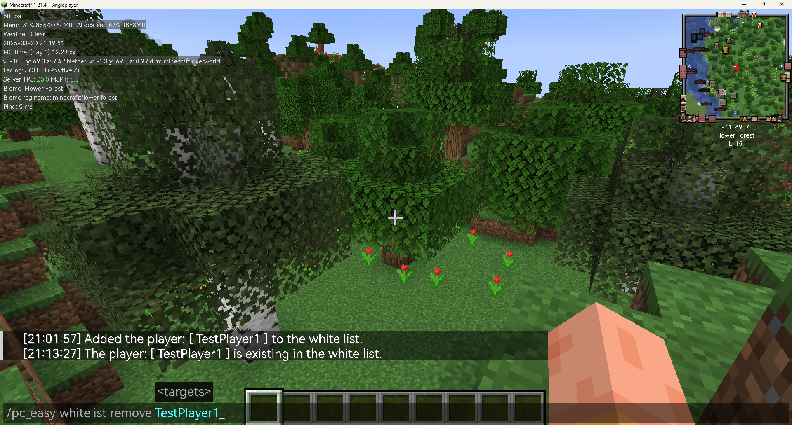
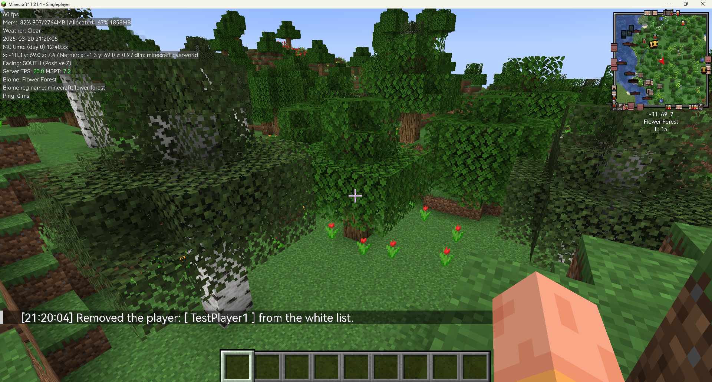

# "PiscesCup Easy" Mod

## Description

The mod provides an easy ways to manage the white list in Minecraft. The mod can be used in `Server` and `Client`.

You can use the name of the player to add or remove them from the white list, op list.

It provides some new commands to manage the white list: 

- Belows are the commands for `whitelist` :
  * `/pc_easy whitelist add <targets>`: Add the `targets` to the white list.
  * `/pc_easy whitelist remove <targets>`: Remove the `targets` from the white list.

- Belows are the commands for `op` :
  * `/pc_easy op add <targets>`: Add the `targets` to the op list.
  * `/pc_easy op remove <targets>`: Remove the `targets` from the op list.

- Belows are the commands for `ban` :
  * `/pc_easy ban_name add <targets>`: Add the `targets` to the ban list.
  * `/pc_easy ban_name remove <targets>`: Remove the `targets` from the ban list.

- Belows are the `setting` command for the mod:
  * `/pc_easy setting lang`: Change or get the language of the mod.
    * `/pc_easy setting lang get`: Get the language of the mod.
    * `/pc_easy setting lang set <lang>`: Set the language of the mod.

## Usages

### Whitelist usages:
#### Add

  The command in the figure is `/pc_easy whitelist add TestPlayer1`
  
    
  If the Player is added successfully, there will be a message `Added the player: [Player] to the white list.` in the chat box:
  
  
  If the Player is already in the white list, there will be a message: `The player: [ Player ] is existing in the white list.` in the chat box:
  
  
#### Remove
  The command in the figure is `/pc_easy whitelist remove TestPlayer1`
  
  If the Player is removed successfully, there will be a message `Removed the player: [ Player ] from the op list.` in the chat box:
  
  If the Player is not in the white list, there will be a message: `The player: [ Player ] is not existing in the op list.` in the chat box:
  

### Op Usages and Ban Usages:
  The usages of the `op` and `ban` are similar as the whitelist.

  But in Ban command, you should use `ban_name` to replace `whitelist`.
