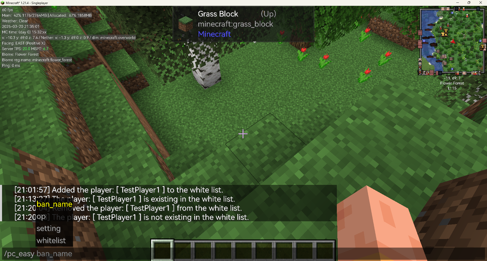

# "PiscesCup Easy" Mod

## Description

The mod provides an easy way to manage the white list in Minecraft. 

The mod can be used in `Server` side and `Client` side.

But I recommend using the mod on the `Server` side. 
Otherwise, after restarting the client, any newly added data will overwrite the original data.

You can use the name of the player to add or remove them from the white list, op list.

It provides some new commands to manage the players in the Minecraft Server: 

- Belows are the commands for `whitelist` :
  * `/pc_easy whitelist add <targets>`: Add the `targets` to the white list.
  * `/pc_easy whitelist remove <targets>`: Remove the `targets` from the white list.

- Belows are the commands for `op` :
  * `/pc_easy op add <targets>`: Add the `targets` to the op list.
  * `/pc_easy op remove <targets>`: Remove the `targets` from the op list.

- Belows are the commands for `ban` :
  * `/pc_easy ban_name add <targets>`: Add the `targets` to the ban list.
  * `/pc_easy ban_name remove <targets>`: Remove the `targets` from the ban list.

- Belows are the `setting` commands for the mod:
  * `/pc_easy setting lang`: Change or get the language of the mod.
    * `/pc_easy setting lang get`: Get the language of the mod.
    * `/pc_easy setting lang set <lang>`: Set the language of the mod.

## Usages

You can use the command in the below figure:

### Whitelist usages:
#### Add

  The command in the figure is `/pc_easy whitelist add TestPlayer1`
  
    
  If the Player is added successfully, the server will send a message: `Added the player: [Player] to the white list.` in the chat box:
  
  
  If the Player is already in the white list, the server will send a message: `The player: [ Player ] is existing in the white list.` in the chat box:
  
  
#### Remove
  The command in the figure is `/pc_easy whitelist remove TestPlayer1`
  
  If the Player is removed successfully, the server will send a message: `Removed the player: [ Player ] from the op list.` in the chat box:
  
  If the Player is not in the white list, the server will send a message: `The player: [ Player ] is not existing in the op list.` in the chat box:
  

### Op Usages and Ban Usages:
  The usages of the `op` and `ban` are similar as the whitelist.

  But in Ban command, you should use `ban_name` to replace `whitelist`.

### Summary
  Belows are the example usages of the commands in the mod:

    /pc_easy whitelist add TestPlayer
    /pc_easy whitelist remove TestPlayer
    /pc_easy op add TestPlayer
    /pc_easy op remove TestPlayer
    /pc_easy ban_name add TestPlayer
    /pc_easy ban_name remove TestPlayer
    /pc_easy setting lang get
    /pc_easy setting lang set en_us
    /pc_easy setting lang set zh_cn

